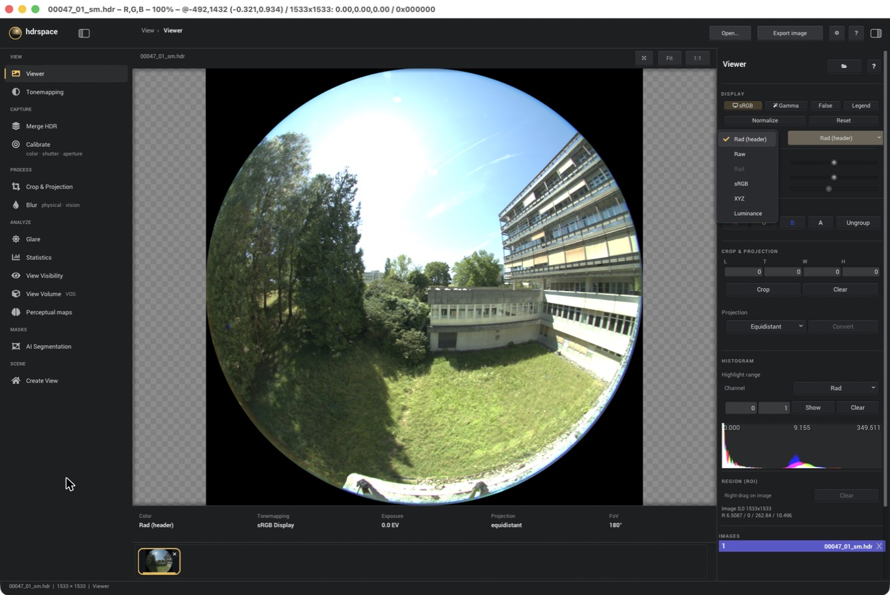
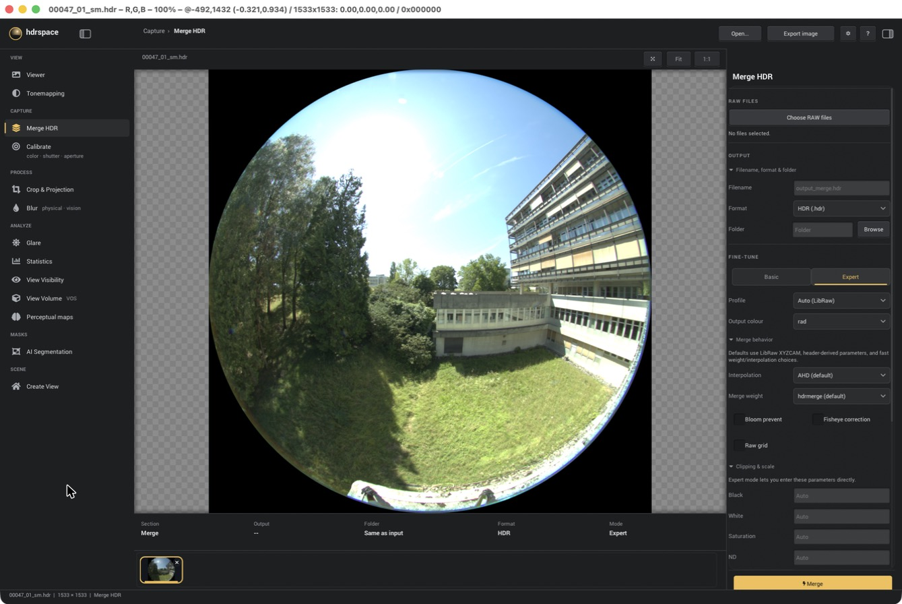
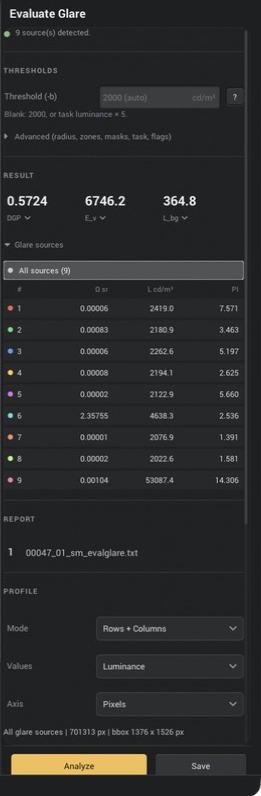
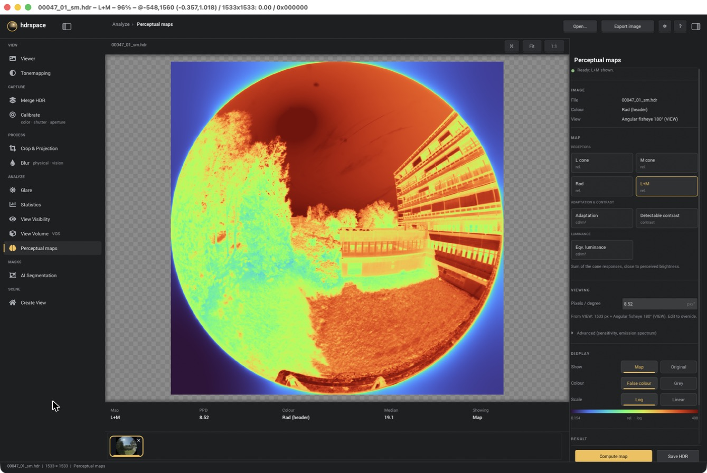
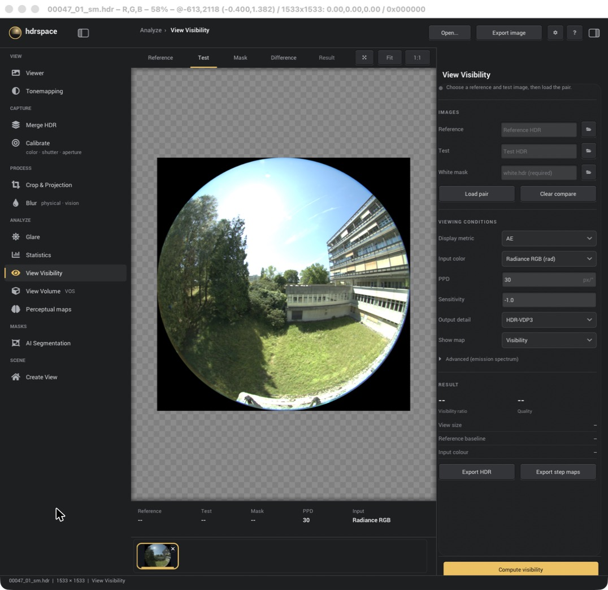

# Using hdrspace

This guide walks through a typical session: look at an HDR image, make one from RAW files, then
analyse it. The screenshots use a 180° fisheye capture of a courtyard.

The window always has the same layout. The **tool rail** is on the left (View, Capture,
Process, Analyze, Masks, Scene). The **canvas** is in the middle, with a strip of open images
underneath. The **inspector** for the current tool is on the right. **Open…** at the top
loads HDR or EXR files, and you can also drop files onto the window. **?** opens the help
window with all keyboard shortcuts.

---

## 1. Look at an image (Viewer)



- **Display**: **sRGB**, **Gamma** or **False** colour. **Legend** shows the false-colour
  scale. **Normalize** stretches the image to its own range and **Reset** puts exposure and
  offset back to zero.
- **Pixel values** sets which numbers you read when you hover, in the histogram and in region
  statistics. It does not change the file.
  - *Rad (header)* shows the values as stored, in the colour space the header declares.
  - *Raw*, *Rad*, *sRGB* and *XYZ* convert to that space.
  - *Luminance* gives Y in cd/m². Radiance files are scaled by 179 here.
- **Region (ROI)**: right-drag on the image to get mean / min / max / std of a region.
- The bar under the canvas shows the file's colour space, tone mapping, exposure, projection
  and field of view (read from the `VIEW` header).

**Files without colour information.** If a file has no primaries or colour header, the colour
shows as *Unknown* and conversions are turned off, because hdrspace does not guess. Use
**Interpret file as** in the same menu to say what the file is: Rad, sRGB, XYZ, Raw, or
Luminance (cd/m²). hdrspace then adds one or two lines (`PRIMARIES=` and `HDRSPACE_COLOR=`) to
the header. It asks before writing and leaves every other header line and all pixel data
unchanged.

## 2. Make an HDR image from RAW files (Merge HDR)



1. **Choose RAW files**: select every frame of one bracket.
2. **Output**: set the file name, format and folder. By default the result goes next to the
   RAW files.
3. **Fine-tune**: *Basic* is enough for most brackets. *Expert* lets you choose:
   - the camera **Profile** (the matrix from the RAW file, or one you made in **Calibrate**);
   - the **Output colour** (`rad`, `srgb` or `xyz`);
   - demosaicing and **Merge weight**;
   - **Fisheye correction**;
   - black, white, saturation and ND values.
4. Press **Merge**. The result opens in the viewer when it is done.

Run **Calibrate** first if you need it. It fits a colour matrix from a photographed chart, and
the real shutter times and apertures of your camera. Its results then appear in the Profile
list.

**About luminance.** The output is in Radiance units in every colour space, and the header
records the luminance weights as `LuminanceRGB`. The [README](../README.md#camera-rgb-to-calibrated-colour-and-luminance)
explains how to get cd/m² from those weights for each colour space.

## 3. Glare



1. Open an HDR image that has a `VIEW` line (fisheye or perspective).
2. Leave **Threshold** blank to use evalglare's default (2000 cd/m², or 5 × the task
   luminance if you set a task area). **Advanced** has the radius, zones, masks, task area and
   the other evalglare flags.
3. Press **Analyze**.

The **Result** row shows DGP, vertical illuminance E_v and background luminance L_bg. Each
small menu switches to another metric (UGR, DGI, CGI, VCP, …). **Glare sources** lists each source with
its solid angle, luminance and position index. Click a row to highlight that source on the
canvas.

**Report** opens the full evalglare output as a table or as raw text, and **Copy** puts it on
the clipboard. **Profile** plots luminance along rows and columns. **Save** writes three files
next to the image: the glare-source HDR, a CSV and the text report.

<br clear="right">

## 4. Perceptual maps



These maps show what the early stages of HDR-VDP 3 compute for one picture:

| Map | What it shows |
|---|---|
| L cone, M cone, Rod | Photoreceptor responses after the eye's optics (glare spread), relative units |
| L+M | Sum of the cone responses, close to perceived brightness |
| Adaptation | Local adaptation luminance, cd/m² |
| Detectable contrast | Contrast that is above the visibility threshold at each pixel |
| Eqv. luminance | Equivalent luminance, as in the Glare tool's equivalent-luminance mode, cd/m² |

1. Pick a map.
2. Check **Pixels / degree**. hdrspace fills it in from the `VIEW` header (image width ÷
   horizontal field of view), and you can overwrite it. Maps that depend on viewing distance
   need a realistic value.
3. Press **Compute map**.

Under **Display**, switch between the **Map** and the **Original** image, **False colour** and
**Grey**, and a **Log** or **Linear** scale. The colour ramp spans the 1st to 99th percentile of
the non-zero values. On a log scale it covers at most four decades, so the dark corners of a
fisheye image don't stretch it. **Result** lists min, median, mean and max. **Save HDR**
writes the map as a grey Radiance HDR file and records the settings in its header.

The colour space must be known (Rad, sRGB, XYZ or Luminance). For an *Unknown* file, set it
first in the Viewer.

## 5. View Visibility



This compares two pictures of the same view, for example with blinds up (**Reference**) and
down (**Test**). It tells you how much of the detectable contrast in the view is still visible.

1. Choose the **Reference**, **Test** and a **White mask**. The mask is an HDR image that is
   white where the view counts, such as the window area. Then press **Load pair**.
2. Set the viewing conditions: input colour space, **PPD** (pixels per degree), sensitivity
   and output detail.
3. Press **Compute visibility**.

The result is a **Visibility ratio** and a **Quality** score. The tabs above the canvas switch
between Reference, Test, Mask, Difference and the Result map. **Export HDR** and **Export step
maps** save the maps for use elsewhere.

---

## Other tools

- **Tonemapping**: previews with the pfstools operators and Radiance `pcond`, with their
  default or man-page example settings.
- **Crop & Projection**: crop, and convert between fisheye projections.
- **Blur**: physical (mm) or vision-based blur.
- **Statistics**: whole-image or region statistics.
- **View Volume, AI Segmentation**: segment buildings and greenery (SAM 3) and estimate depth
  (Depth Anything 3). The models are downloaded the first time you use them.
- **Create View**: render a Radiance scene from a chosen view.

## Command line

Everything in Merge HDR and Calibrate is also available from `mergehdr`:

```
mergehdr --help
mergehdr run ...            # RAW bracket -> HDR
mergehdr colorcalibrate ... # chart -> colour matrix
mergehdr shutter ... / mergehdr aperture ...
```
